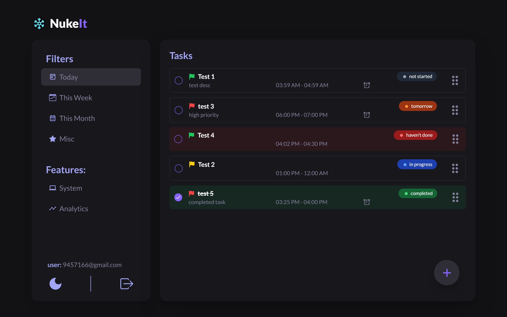
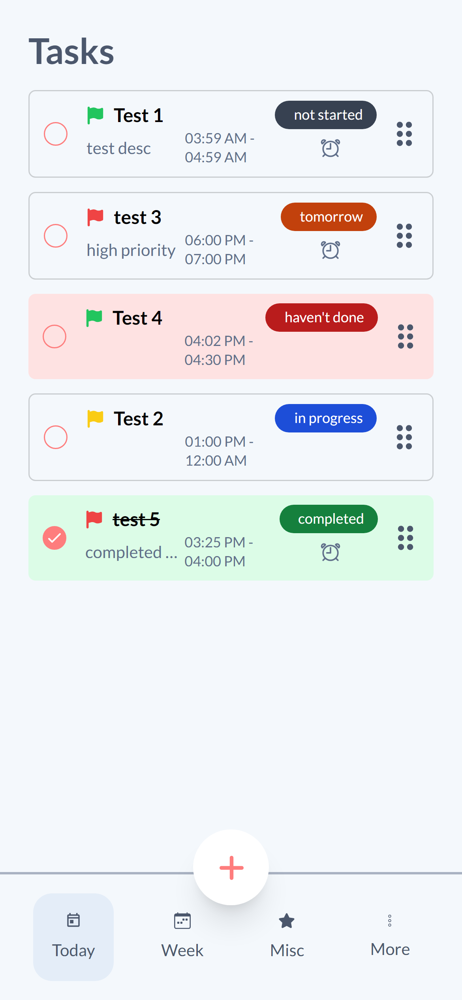

    
    <h1>Nuke It</h1>
    
Nuke It is an advanced task management application designed to enhance productivity by offering a streamlined and user-friendly interface. It supports users in organizing, prioritizing, and tracking their tasks efficiently, ensuring they stay on top of their daily, weekly, monthly and miscellaneous responsibilities.

---

## Live Demo

Visit [nuke-it.vercel.app](https://nuke-it.vercel.app/) to see the project in action.

Guest login credentials :-

- email : kuchbhi5611@gmail.com
- password: passpass

## Screenshots

   
   
   
   
   
   
   

## Key Features

- **Sleek User Interface:** Modern, intuitive design interface designed for ease of use.
- **Task Management:** Create, update, delete, and view tasks with ease.
- **Task Filtering:** Filter tasks by type, status, priority, and more.
- **Optimistic UI Updates:** Immediate feedback for task creation and updates.
- **Modular and Scalable:** Built with reusable components, making it easy to maintain and scale.
- **User Accounts:** Create and manage accounts to access tasks across multiple devices.
- **Dark Mode:** Switch to dark mode for enhanced usability in low-light environments.

## Tech Stack

This project is built using a variety of technologies:

- **Frontend**: Next.js, React.js, Tailwind CSS
- **Backend**: Supabase (for database management and user authentication)
- **State management**: Zustand
- **Utilities:** React Hook Form, React Hot Toast

## Future Enhancements

- **Push Notifications:** Integrate with OneSignal or other service to send push notifications.
- **Subscription Features:** Introduce Stripe for subscription management and payments.
- **Drag and Drop:** Implement drag and drop functionality to reorder tasks seamlessly.
- **Sound Effects:** Add sound effects for completing tasks to enhance user experience.
- **UI Refactor:** Potentially refactor the task component UI for improved aesthetics and usability.

## Installation

To install and run this project locally, follow these steps:

1. Clone the repository.
   - `git clone https://github.com/web-sujal/NukeIt.git`
2. Install dependencies:
   - `npm install` or `yarn install`.
3. Install tailwind CSS with Next.js:

   - `npm install -D tailwindcss postcss autoprefixer`

   `npx tailwindcss init -p`

4. Start the development server:
   - `npm run dev` or `yarn dev`.

Open http://localhost:3000 with your browser to see the result.

## License

This project is licensed under the MIT License.
